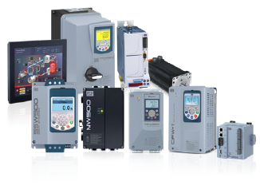

<div align="center">


<br/>




</div>

---

### $ whoami

```bash
Ryhan Schutz
Estudante Técnico em CiberSistemas para Automação — CentroWEG
Jaraguá do Sul, SC
```

Automação industrial, CLPs, elétrica e sistemas embarcados.  
Estudante técnico com vivência prática no chão de fábrica.

---

## Hardware & Plataformas

> O que de fato já pus a mão

<div align="center">

| Linha | Plataformas |
|-------|-------------|
| **Siemens** | S7-200 · S7-300 · S7-1200 · TIA Portal |
| **Mitsubishi** | FX1N · FX3U · FX5U · GX Works 2/3 |
| **WEG** | CLP350 · PLC-WEG · WEGClic02 |
| **Embarcados** | Arduino · ESP32 · STM32 |

</div>

---

## Stack

<div align="center">


</div>

---

## GitHub

<div align="center">

</div>

<div align="center">


</div>

---

## Contato

<div align="center">

[](https://www.linkedin.com/in/ryhanschutz/)
[](mailto:ryhanschutz@gmail.com)
[](https://ryhanschutz.dev)

</div>

---

<div align="center">
  <sub>🚬 at work</sub>
</div>
